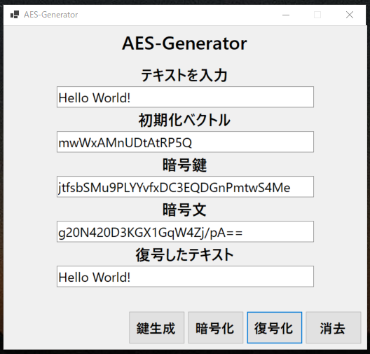

# AES-Generator

## 概要

共通鍵暗号(AES-256)を自動生成するアプリケーションです。

暗号化を気軽に体験できます。

## 使用技術

C#/Windows Forms

## 使い方

1. 一番上のテキストボックスに暗号化したいテキストを入力します。

2. **鍵生成ボタン**をクリックして、暗号鍵を生成します。

3. **暗号化ボタン**をクリックして、テキストを暗号化します。

4. **復号化ボタン**をクリックすれば、暗号文からテキストを復号します。

5. **消去ボタン**でテキストボックスを初期化できます。

©2023 Reiji Ogura